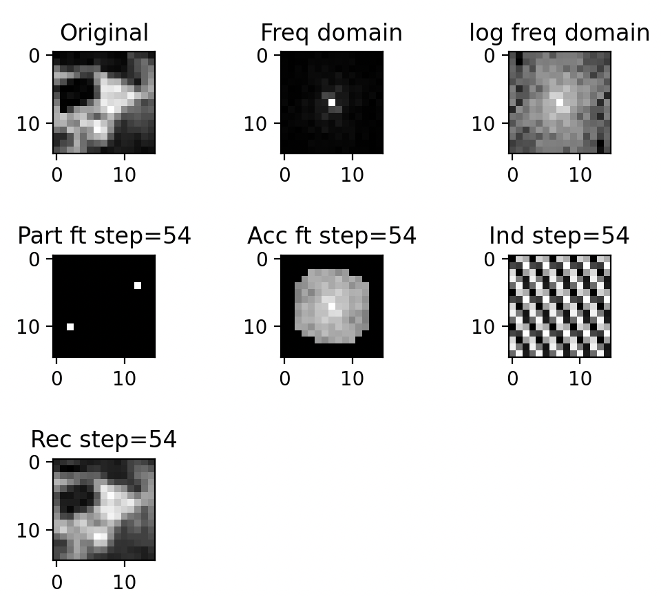

A python script demonstrating how 2D Fourier Transform works on example of the image.



You can experiment with your own images by changing this line:

```python
image_filename = "16x16.jpg"
```

Animation includes the shift for easier imagination of how it works.

